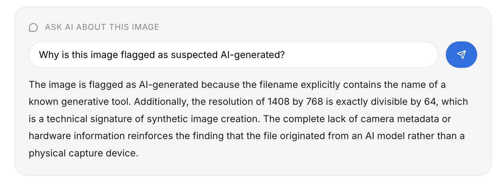
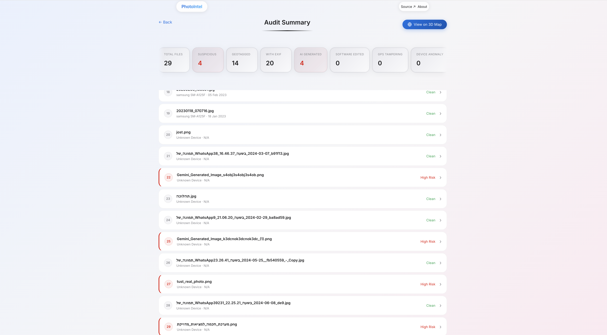

# PhotoIntel
 


 
**Advanced forensic intelligence platform for image authentication and geospatial auditing.**
 
> PhotoIntel analyzes image metadata to detect manipulation, verify GPS integrity, identify AI-generated content, and visualize geotagged evidence on an interactive 3D globe.
 
---
 
## 🌐 Live Demo
 
**[→ Visit PhotoIntel Live](https://ebfdf627-231a-4352-873b-b3e4e19a0599-00-36gz5i2d1bcrs.pike.replit.dev/)**
 
> Note: The Replit server must be active for the link to work.
 
---
 
## 📸 System Previews
 
<div align="center">
  
  <br>
  <em>Interactive CesiumJS globe displaying geotagged evidence, device location clusters, and forensic statistics.</em>
</div>
 
<br>
 
<div align="center">
  
  <br>
  <em>AI-powered forensic assistant explaining why an image was flagged — in any language.</em>
</div>
 
<br>
 
<div align="center">
  
  <br>
  <em>Audit Summary dashboard with batch analysis, risk scoring, and flagged image detection.</em>
</div>
 
<br>
 
<div align="center">
  
  <br>
  <em>Per-image forensic detail panel with device signature, timestamp, and geospatial coordinates.</em>
</div>
 
---
 
## 🔍 Features
 
- **AI Signature Detection** — Identifies generative AI fingerprints through software signatures, resolution patterns, and filename heuristics
- **Geospatial Integrity** — Validates GPS coordinates against physical boundaries and detects location spoofing
- **Temporal Forensics** — Exposes post-processing tampering by cross-referencing capture and modification timestamps
- **Optical Consistency** — Audits exposure settings (ISO, aperture, shutter speed) against declared capture conditions
- **Device Chain-of-Custody** — Tracks device transitions across the image timeline
- **Spatial-Temporal Analysis** — Detects physically impossible travel speeds between consecutive geotagged images
- **3D Globe Visualization** — Interactive CesiumJS globe with timeline trajectories and device-switch overlays
- **AI Forensic Assistant** — Ask questions about any flagged image and receive direct, technical explanations
 
---
 
## 🛠️ Tech Stack
 
| Layer     | Technology                        |
|-----------|-----------------------------------|
| Backend   | Python, FastAPI, Pillow           |
| Frontend  | HTML, CSS, JavaScript             |
| 3D Globe  | CesiumJS                          |
| AI Engine | Gemini API                        |
| Icons     | Lucide                            |
 
---
 
## ⚙️ Installation
 
### 1. Clone the repository
 
```bash
git clone https://github.com/Shilo-Wexler/PhotoIntel.git
cd PhotoIntel
```
 
### 2. Install Python dependencies
 
```bash
pip install -r requirements.txt
```
 
### 3. Configure your API keys
 
Create `config.py` in the project root (gitignored — never committed):
 
```python
CESIUM_TOKEN   = 'YOUR_CESIUM_ION_TOKEN'    # https://cesium.com/ion/tokens
GEMINI_API_KEY = 'YOUR_GEMINI_API_KEY'      # https://aistudio.google.com
```
 
Create `app/config.js` (gitignored — never committed):
 
```javascript
const CONFIG = {
    CESIUM_TOKEN: 'YOUR_CESIUM_ION_TOKEN'
};
```
 
> ⚠️ Both files are gitignored. See `app/config.example.js` for the frontend template.
 
### 4. Run the server
 
```bash
python main.py
```
 
Open your browser at:
 
```
http://localhost:8080
```
 
---
 
## 📁 Project Structure
 
```
PhotoIntel/
├── app/                    # Frontend (served as static files)
│   ├── index.html
│   ├── base.css            # Design tokens, reset, navigation
│   ├── landing.css         # Landing page styles
│   ├── app.css             # Application screen styles
│   ├── app.js              # SPA controller, navigation, file upload
│   ├── ui.js               # Report rendering (stats strip, image list)
│   ├── map.js              # Map sidebar and data integration
│   ├── map_view.js         # CesiumJS globe wrapper
│   └── config.js           # ⚠️ Gitignored — create manually
├── src/
│   ├── analyzer/           # Forensic rule engines
│   ├── extractor/          # EXIF metadata extraction
│   ├── models/             # Data models
│   ├── constants/          # Forensic and geographic thresholds
│   └── converters.py
├── tests/
├── img/                    # README screenshots
├── main.py                 # FastAPI entry point
├── config.py               # ⚠️ Gitignored — create manually
└── requirements.txt
```
 
---
 
## 👤 About
 
Developed by **Shilo Wexler** — Computer Science and Physics student at The Open University of Israel, with a focus on data integrity and digital forensics.
 
PhotoIntel began as a group capstone project during an intensive Python specialization and was independently expanded into a full-stack forensic intelligence platform.
 
[](https://www.linkedin.com/in/shilo-wexler)
[](https://github.com/Shilo-Wexler)
 
---
 
## 📄 License
 
Released under the [MIT License](LICENSE).
 